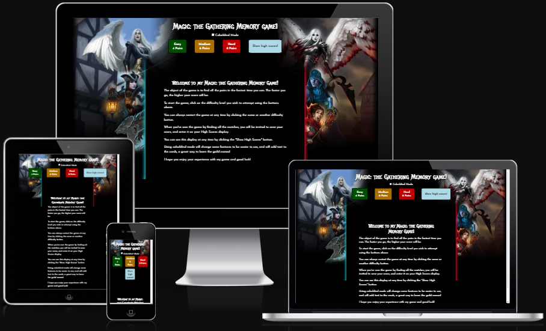

# Magic: the Gathering Memory Game
Code Institute Project Milestone 2 - Interactive Front End Development

## Table of Contents

+ [Live Demo](#demo)
+ [UX](#ux)
+ [User Stories](#user-stories)
  + [Strategy](#strategy)
+ [Scope](#scope)
  + [Structure](#structure)
  + [Skeleton](#skeleton)
  + [Surface](#surface)
+ [Technologies](#technologies)
+ [Features](#features)
+ [Deployment](#deployment)
+ [Validator Testing](#validator-testing)
+ [Credits](#credits)

## Demo
A live demo to the website can be found [here](https://arcandrus.github.io/milestone-2/index.html)

## UX
Given that this is a one page project I wanted to focus on presenting a clean and polished game to the user.

## User Stories
My focus for this project was on delivering a polished and enjoyable experience to users. As such, these were the main points I considered.
+As a user, I want to be able to quickly understand the premises of the game.
+As a user, I want to be able to choose a difficulty level I am comfortable with.
+As a user, I want to be able to understand my progress if I'm doing better than I was before.
+As a user, I want to be able to change my difficulty whenever I choose.

## Strategy
The goal is to make a functional and well presented memory game based on the mana and clan symbols for the popular trading card game, Magic: the Gathering.

## Scope
For the users, I wanted to make sure the game was as self explanitory as possible and not confusing to begin or play. I wanted to present it as minimalistically as possible to ensure there is no visual or audio clutter to the experience.

## Structure
The key area I focused on during planning for this was to make everything responsive and usable on all devices while not losing and functionality or compromising presentation. To do this, I used Bootstrap for an easy way to build a responsive and interactive grid system so I could ensure control at all breakpoints for visual display.

## Skeleton
I didn't have to consider much when it came to the skeleton as the basic formatting of the game was very clear to me. Everything is presented centrally aligned and will resize itself while keeping the same layout across all devices.

The Wireframe design can be found [here](./readme-assets/mtg_memory_game_wireframe.pdf) (pdf format).

## Surface
I used a very simple and subtle color scheme for this project as again I didn't want to introduce visual clutter to the experience.

## Technologies
**HTML** - To create a basic site skeleton and add the content.

**CSS** - To create a controlled and consistent display for each element and to give a great user experience

**Javascript** - This is where most of the work for this project was done, as the entire system runs on Javascript. The game.js controls all of the interactive functionality of the page.

**Balsamiq** - To create a wireframe

# Features
The game features a choice of three difficulty levels;
+Easy, the player is required to find 4 pairs as quickly as possible
+Medium, the player is required to find 6 pairs as quickly as possible.
+Hard, the player is required to find 8 pairs as quickly as possible.

Once the player selects thier difficulty, the game and timer starts, generating the chosen amount of pairs from an array of possibilities. The player must then chose which cards they wish to check for a match. Once two cards are chosen the game will check if they match and proceed by either keeping the cards displayed, or flipping them face down to try again.

Once all paris are found the game will tell you you've won and generate a score based on difficulty level and time taken.

## Deployment
The site has not yet been deployed using [GitPages](https://pages.github.com) in the following way.
+ In the Github repository, the Setting tab.
+ Under General, navigate to Code and Automation and select 'Pages'.
+ In the Build and Deployment section for Source, select 'Deploy from a branch' from the drop-down list.
+ For Branch, select 'main' from the drop-down list and Save.
+ On the top of the page, the link to the complete website is provided.
+ The deployed site will update automatically upon new commits to the master branch.

## Validator Testing
**HTML** Not yet tested [W3C Validator](./readme-assets/html_pass.png)

**CSS** Not yet tested [Jigsaw Validator](./readme-assets/css_pass.png)

**Accessibility** Not yet tested using [Lighthouse DevTools](./readme-assets/lighthouse.png)

I have also asked several users to explore the website on different devices including iPhone 14, iPad, Oppo mobile devices, Sony mobile devices and several different PC and Laptop setups to ensure consitency and usability across multiple platforms.  

## Credits

[MDN WebDocs](https://developer.mozilla.org/en-US/), [W3Schools](https://www.w3schools.com) and [Stack Overflow](https://stackoverflow.co/teams/) were used to help general understanding and troubleshooting specific problems as I progressed.

I would also like to thank my mentor, Medale Oluwafemi, for his insights and support during this project and my friends Rew and Emma who have helped me with testing and troubleshooting.
