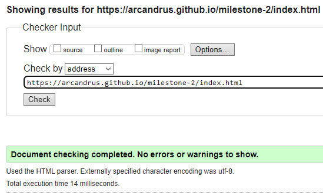

# Magic: the Gathering Memory Game
Code Institute Project Milestone 2 - Interactive Front End Development

## Table of Contents

1. [Live Demo](#demo)
2. [User Stories](#user-stories)
3. [Design](#design)
4. [Technologies](#technologies)
5. [Features](#features)
6. [Deployment](#deployment)
7. [Testing](#testing)
8. [Credits](#credits)

## Demo
A live demo to the website can be found [here](https://arcandrus.github.io/milestone-2/index.html)

## User Stories
My focus for this project was on delivering a polished and enjoyable experience to users. As such, these were the main points I considered.

+ As a user, I want to be able to quickly understand the premise of the game.
+ As a user, I want to choose a difficulty level I am comfortable with.
+ As a user, I want to be able to understand my progress if I'm doing better than I was before.
+ As a user, I want to be able to change my difficulty whenever I choose.
+ As a user with specific needs, I would like to see accessablity options to suit me.

## Design & UX
Taking into account Strategy, Scope, Structure, Skeleton and surface, together with User Stories and desired outcomes, I decided on these points while building this project.

The goal is to make a functional and well presented memory game based on the mana and clan symbols for the popular trading card game, Magic: the Gathering. For the users, I wanted to make sure the game was as self explanitory as possible and not confusing to begin or play. I wanted to present it as minimalistically as possible to ensure there is not a lot of visual or audio clutter to the experience. The key area I focused on during planning for this was to make everything responsive and usable on all devices while not losing and functionality or compromising presentation. To do this, I used Bootstrap for an easy way to build a responsive and interactive grid system so I could ensure control at all breakpoints for visual display. I didn't have to consider much when it came to the skeleton as the basic formatting of the game was very clear to me. Everything is presented centrally aligned and will resize itself while keeping the same layout across all devices.

The Wireframe design can be found [here](./readme-assets/mtg_memory_game_wireframe.pdf) (pdf format).

I used a very simple color scheme based on the background image I'm using which features prominent characters from Magic: the Gathering for this project as again I didn't want to introduce visual clutter to the experience.

## Technologies
**HTML** - To create a basic site skeleton and add the content.

**CSS** - To create a controlled and consistent display for each element and to give a great user experience

**Javascript** - This is where most of the work for this project was done, as the entire system runs on Javascript. The game.js controls all of the interactive functionality of the page.

**Balsamiq** - To create a wireframe

**Bootstrap** - To ensure responsive design and usability across all devices.

# Features

**Difficulty Options**
The game features a choice of three difficulty levels;

+ Easy, the player is required to find 4 pairs as quickly as possible
+ Medium, the player is required to find 6 pairs as quickly as possible.
+ Hard, the player is required to find 8 pairs as quickly as possible.

Once the player selects thier difficulty, the game and timer starts, generating the chosen amount of pairs from an array of possibilities. 

**Card Flipping**
The player must then chose which cards they wish to check for a match. Once two cards are chosen the game will check if they match and proceed by either keeping the cards displayed, or flipping them face down to try again.

Cards being matched (the gif repeats but in the game the matched pair remain visable) 

Cards do not match 

**Winning the Game**
Once all paris are found the game will tell you you've won and generate a score based on difficulty level and time taken, then a modal will allow the player to enter thier name, which will be saved locally along with thier score. This information is stored locally. 

Save score modal 

There is also a button that opens a modal to display the current high scores for each difficulty and who set them. This modal also gives the option to reset the high scores.

High score modal 

**Colorblind Mode**
I've also added a colorblind mode that add description text to the images on the cards makes the buttons all appear in a uniform, high-contrast display.

Difficulty buttons with colorblind mode on

Standard card display

Colorblind card display

## Deployment
The site has not yet been deployed using [GitPages](https://pages.github.com) in the following way.
+ In the Github repository, the Setting tab.
+ Under General, navigate to Code and Automation and select 'Pages'.
+ In the Build and Deployment section for Source, select 'Deploy from a branch' from the drop-down list.
+ For Branch, select 'main' from the drop-down list and Save.
+ On the top of the page, the link to the complete website is provided.
+ The deployed site will update automatically upon new commits to the master branch.

## Testing

HTML Tested and passed by W3C Validator

CSS Tested and passed by Jigsaw Validator

Accessibility Tested and passed by Lighthouse DevTools

### Manual Testing

All these features were manually tested by me and several others, these are the results of those tests.

| Feature | Expectation | Action | Result |
| ---------- | ---------- | ------------ | ----------- |
|Starting a new game|The game will generate the right amount of cards given the chosen difficulty.|Clicking the chosen button|Working as intended|
|Displaying High Scores|A modal reading data from localStorage will display the high scores in a modal window.|Clicking the high score button|Working as intended|
|Colorblind Mode|When enabled, the colored buttons at the top of the screen are redesigned to be high-contrast and the card images feature a text description.|Clicking the "Colorblind Mode" checkbox|Working as intended|
|Card Flipping|When a user clicks on a chosen card, it flips to reveal its image.|Clicking on a card|Working as intended|
|Card Matching|When a user clicks on a second chosen card, it flips to reveal its image. The game then tests them against eachother to see if a match has occured.|Clicking on a second card|Working as intended|
|Card Resetting|When a user clicks on a second chosen card, it flips to reveal its image. If the two chosen cards do not match the game resets them to face-down after a 1sec delay.|Clicking on a second card|Working as intended|
|Timer|Timer increments each second and displays this to the user.|Game start|Working as intended|
|Matches|Each time a match is found, the counter increments and displays this to the user.|When a mactch is found|Working as intended|
|Score calculation|The user score is calculated using this equation, score = Math.ceil((matches * 100) / timeCount); generating a higher score for faster completion.|Game Completion|Working as intended|
|Score saving|The user score saved into localStorage by entering thier name in a modal after the game is completed.|Game Completion|Working as intended|
|Displaying top 5 Scores for each difficulty|A modal reading data from localStorage will display the top 5 high scores for each difficulty in a modal window.|Clicking the high score button|Working as Intended|

While developing this project, I mainly relied on console.log() and devtools to help me with troubleshooting and bug fixing.

I have also asked several users to explore the website on different devices including iPhone 14, iPad, Oppo mobile devices, Sony mobile devices and several different PC and Laptop setups to ensure consitency and usability across multiple platforms.  

## Credits

[MDN WebDocs](https://developer.mozilla.org/en-US/), [W3Schools](https://www.w3schools.com) and [Stack Overflow](https://stackoverflow.co/teams/) were used to help general understanding and troubleshooting specific problems as I progressed.

I would also like to thank my mentor, Medale Oluwafemi, for his insights and support during this project and my friends Rew and Emma and the Frome MTG club who have helped me with testing and troubleshooting.
